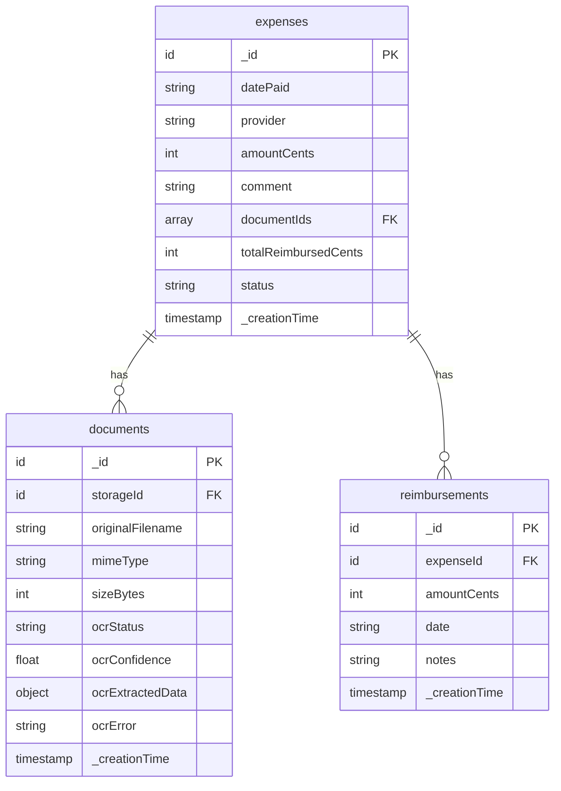

# HSA Medical Expense Tracker Application

## Overview

A web application for tracking qualified HSA (Health Savings Account) medical expenses. The app stores statements and receipts from out-of-pocket expenses, automatically extracts data from uploaded documents using OCR, supports manual data entry and correction, tracks reimbursement status (including partial reimbursements), and includes an optimizer to find the best combination of expenses for a given reimbursement amount.

## Problem Statement / Motivation

HSA accounts allow tax-free reimbursement of qualified medical expenses at any time, even years after the expense was incurred. However, tracking which expenses have been paid out-of-pocket, storing receipts, and determining optimal reimbursement combinations is tedious and error-prone when done manually. This application solves these problems by:

1. **Centralizing storage** - All receipts and expense data in one place with cloud backup
2. **Automating data entry** - OCR extracts expense details from receipts/statements
3. **Tracking reimbursement status** - Know exactly what's been reimbursed (fully or partially)
4. **Optimizing reimbursements** - Find the fewest expenses to match a target dollar amount

## Proposed Solution

### Technology Stack

| Layer | Technology | Rationale |
|-------|------------|-----------|
| **Frontend** | React 18 + TypeScript | Modern, type-safe, large ecosystem |
| **Build Tool** | Vite | Fast development, optimized builds |
| **UI Components** | shadcn/ui | Beautiful, accessible, fully customizable components |
| **Styling** | Tailwind CSS v4 | Utility-first CSS, integrated with shadcn |
| **Backend** | Convex | Real-time sync, file storage, TypeScript-first |
| **OCR** | Google Cloud Document AI | Expense Parser with pre-built receipt understanding |
| **Forms** | React Hook Form + Zod | Type-safe form validation |
| **Tables** | TanStack Table | Powerful data table with sorting, filtering, pagination |
| **Testing** | Vitest + convex-test | Native TypeScript testing |

### Architecture Overview

```
┌─────────────────────────────────────────────────────────────────┐
│                     React Frontend (shadcn/ui)                  │
│  ┌──────────┐  ┌──────────┐  ┌──────────┐  ┌──────────────────┐│
│  │ Expense  │  │ Upload & │  │Reimburse-│  │   Optimizer      ││
│  │   CRUD   │  │   OCR    │  │  ment    │  │                  ││
│  └────┬─────┘  └────┬─────┘  └────┬─────┘  └────────┬─────────┘│
└───────┼─────────────┼─────────────┼─────────────────┼──────────┘
        │             │             │                 │
        ▼             ▼             ▼                 ▼
┌─────────────────────────────────────────────────────────────────┐
│                     Convex Backend                              │
│  ┌──────────┐  ┌──────────┐  ┌──────────┐  ┌──────────────────┐│
│  │ expenses │  │ _storage │  │reimburse-│  │  Optimizer       ││
│  │  table   │  │  (files) │  │  ments   │  │  Action          ││
│  └──────────┘  └──────────┘  └──────────┘  └──────────────────┘│
└─────────────────────────────────────────────────────────────────┘
                              │
                              ▼
                    ┌──────────────────┐
                    │ Google Cloud     │
                    │ Document AI      │
                    │ (Expense Parser) │
                    └──────────────────┘
```

## Technical Approach

### Data Model (Convex Schema)

```typescript
// convex/schema.ts
import { defineSchema, defineTable } from "convex/server";
import { v } from "convex/values";

export default defineSchema({
  expenses: defineTable({
    datePaid: v.string(),           // ISO date (YYYY-MM-DD)
    provider: v.string(),           // Provider/vendor name
    amountCents: v.number(),        // Amount in cents (integer)
    comment: v.optional(v.string()),
    documentIds: v.array(v.id("documents")),
    totalReimbursedCents: v.number(),  // Denormalized for queries
    status: v.union(
      v.literal("unreimbursed"),
      v.literal("partial"),
      v.literal("reimbursed")
    ),
  })
    .index("by_status", ["status"])
    .index("by_date", ["datePaid"])
    .index("by_status_and_date", ["status", "datePaid"]),

  documents: defineTable({
    storageId: v.id("_storage"),
    originalFilename: v.string(),
    mimeType: v.string(),
    sizeBytes: v.number(),
    ocrStatus: v.union(
      v.literal("pending"),
      v.literal("processing"),
      v.literal("completed"),
      v.literal("failed")
    ),
    ocrConfidence: v.optional(v.number()),
    ocrExtractedData: v.optional(v.object({
      amount: v.optional(v.object({
        valueCents: v.number(),
        confidence: v.number(),
      })),
      date: v.optional(v.object({
        value: v.string(),
        confidence: v.number(),
      })),
      provider: v.optional(v.object({
        value: v.string(),
        confidence: v.number(),
      })),
    })),
    ocrError: v.optional(v.string()),
  }),

  reimbursements: defineTable({
    expenseId: v.id("expenses"),
    amountCents: v.number(),
    date: v.string(),               // ISO date
    notes: v.optional(v.string()),
  })
    .index("by_expense", ["expenseId"]),
});
```

### shadcn/ui Components to Use

| Feature | shadcn Components | Purpose |
|---------|-------------------|---------|
| **Expense List** | Table, Badge, Button, DropdownMenu | Display expenses with status badges and actions |
| **Expense Form** | Form, Input, Select, Calendar, Popover | Create/edit expenses with validation |
| **File Upload** | Input (file), Card, Progress | Upload receipts with drag-and-drop |
| **OCR Review** | Card, Alert, Badge, Button | Review extracted data with confidence indicators |
| **Dialogs** | Dialog, AlertDialog, Sheet | Confirmations, forms, side panels |
| **Notifications** | Sonner (toast) | Success/error feedback |
| **Dashboard** | Card, Separator | Summary statistics |
| **Optimizer** | Input, Card, Checkbox, Button | Target input and results display |

### Implementation Phases

#### Phase 1: Project Setup & Core Infrastructure

**Deliverables:**
- Vite + React + TypeScript project initialized
- shadcn/ui configured with Tailwind CSS v4
- Convex backend configured
- Basic project structure established

**Tasks:**
- [x] Initialize Vite project with React + TypeScript template
- [x] Configure TypeScript path aliases (`@/*` → `./src/*`)
- [x] Install and configure Tailwind CSS v4 with `@tailwindcss/vite`
- [x] Initialize shadcn/ui (`pnpm dlx shadcn@latest init`)
- [x] Install and configure Convex (`pnpm add convex && npx convex init`)
- [x] Create Convex schema for all tables
- [x] Set up project folder structure
- [x] Add base shadcn components: Button, Card, Input, Form

**Files to create:**
```
src/
├── components/
│   └── ui/              # shadcn components (auto-generated)
├── lib/
│   └── utils.ts         # cn() utility (auto-generated)
├── App.tsx
└── main.tsx
convex/
├── schema.ts            # Database schema
└── _generated/          # Auto-generated types
```

**Commands:**
```bash
# Initialize project
pnpm create vite@latest . --template react-ts
pnpm install

# Tailwind CSS v4
pnpm add tailwindcss @tailwindcss/vite

# shadcn/ui
pnpm dlx shadcn@latest init

# Convex
pnpm add convex
npx convex init

# Additional dependencies
pnpm add react-hook-form zod @hookform/resolvers
pnpm add -D @types/node
```

**Success Criteria:**
- [x] `pnpm dev` starts without errors
- [x] shadcn Button component renders correctly
- [x] Convex dashboard accessible

---

#### Phase 2: Expense CRUD Operations

**Deliverables:**
- Expense list with sorting and filtering
- Create/edit expense form with validation
- Delete expense with confirmation
- Currency formatting throughout

**Tasks:**
- [x] Install shadcn components: Table, Form, Input, Select, Calendar, Popover, Dialog, AlertDialog, Badge, DropdownMenu, Sonner
- [x] Implement expense mutations: `createExpense`, `updateExpense`, `deleteExpense`
- [x] Implement expense queries: `listExpenses`, `getExpense`
- [x] Create `ExpenseTable` component using TanStack Table + shadcn Table
- [x] Create `ExpenseForm` component with React Hook Form + Zod validation
- [x] Create `ExpenseDialog` for create/edit modal
- [x] Create `DeleteExpenseDialog` with AlertDialog
- [x] Add currency utilities (cents ↔ dollars conversion)
- [x] Add Sonner for toast notifications
- [x] Implement status badges (unreimbursed, partial, reimbursed)

**shadcn Components:**
```bash
pnpm dlx shadcn@latest add table form input select calendar popover dialog alert-dialog badge dropdown-menu sonner button card
pnpm add @tanstack/react-table
```

**Files to create:**
```
src/
├── components/
│   ├── expenses/
│   │   ├── expense-table.tsx        # Data table with columns
│   │   ├── expense-columns.tsx      # Column definitions
│   │   ├── expense-form.tsx         # Form with validation
│   │   ├── expense-dialog.tsx       # Create/edit modal
│   │   └── delete-expense-dialog.tsx
│   └── ui/                          # shadcn components
├── lib/
│   ├── utils.ts
│   └── currency.ts                  # Currency formatting
convex/
├── schema.ts
└── expenses.ts                      # Mutations and queries
```

**Expense Form Schema (Zod):**
```typescript
// src/lib/validations/expense.ts
import { z } from "zod"

export const expenseSchema = z.object({
  datePaid: z.date({ required_error: "Date is required" }),
  provider: z.string().min(1, "Provider is required").max(200),
  amount: z.coerce
    .number({ invalid_type_error: "Amount must be a number" })
    .positive("Amount must be positive")
    .multipleOf(0.01, "Amount cannot have more than 2 decimal places"),
  comment: z.string().max(1000).optional(),
})

export type ExpenseFormData = z.infer<typeof expenseSchema>
```

**Success Criteria:**
- [ ] Can create, read, update, delete expenses
- [ ] Form validation prevents invalid submissions
- [ ] Currency displays as $XX.XX format
- [ ] Toast notifications on success/error
- [ ] Real-time updates when data changes

---

#### Phase 3: Document Upload & Storage

**Deliverables:**
- Drag-and-drop file upload UI
- Image/PDF compression before storage
- Document attachment to expenses
- Document viewing in modal

**Tasks:**
- [x] Add documents table to Convex schema
- [x] Implement `generateUploadUrl` mutation
- [x] Implement `saveDocument` mutation
- [x] Install react-dropzone for drag-and-drop
- [x] Create `FileUploader` component with dropzone styling
- [x] Add client-side image compression (browser-image-compression)
- [x] Create `DocumentGallery` component to display attachments
- [x] Create `DocumentViewer` dialog for full-size view
- [x] Implement document deletion
- [x] Add file type validation (JPEG, PNG, PDF)
- [x] Add file size validation (max 10MB before compression)
- [x] Add upload progress indicator

**Additional Dependencies:**
```bash
pnpm add react-dropzone browser-image-compression
pnpm dlx shadcn@latest add progress avatar
```

**Files to create:**
```
src/
├── components/
│   ├── documents/
│   │   ├── file-uploader.tsx        # Drag-and-drop upload
│   │   ├── document-gallery.tsx     # Thumbnail grid
│   │   └── document-viewer.tsx      # Full-size modal
│   └── ui/
├── lib/
│   └── compression.ts               # Image compression
convex/
└── documents.ts                     # Document mutations
```

**Success Criteria:**
- [ ] Can drag-and-drop or click to upload files
- [ ] Images compressed to < 500KB before upload
- [ ] Upload progress displayed
- [ ] Documents display as thumbnails in expense view
- [ ] Can click to view full document
- [ ] Invalid file types show error message

---

#### Phase 4: OCR Integration

**Deliverables:**
- Google Cloud Document AI integration
- Automatic data extraction from receipts
- Review/edit UI with confidence indicators

**Tasks:**
- [ ] Set up Google Cloud project and enable Document AI API
- [ ] Create Expense Parser processor in Document AI
- [ ] Add Google Cloud credentials to Convex environment variables
- [ ] Implement `processDocument` Convex action
- [ ] Map Document AI response to expense fields
- [ ] Create `OcrReviewCard` component showing extracted data
- [ ] Add confidence badges (high/medium/low)
- [ ] Side-by-side view: original document + extracted fields
- [ ] "Apply" button to use extracted data
- [ ] Handle OCR failures gracefully with manual entry fallback
- [ ] Add retry logic for transient failures

**Files to create:**
```
src/
├── components/
│   ├── ocr/
│   │   ├── ocr-review-card.tsx      # Extracted data display
│   │   └── confidence-badge.tsx     # Visual confidence indicator
convex/
└── ocr.ts                           # Document AI integration
```

**OCR Field Mapping:**

| Document AI Field | Expense Field | Transformation |
|-------------------|---------------|----------------|
| `total_amount` | `amountCents` | Parse, multiply by 100, round |
| `supplier_name` | `provider` | Trim whitespace |
| `receipt_date` | `datePaid` | Parse to ISO format |

**Confidence Thresholds:**
- **High** (≥0.9): Green badge, auto-filled
- **Medium** (0.7-0.9): Yellow badge, review suggested
- **Low** (<0.7): Red badge, manual verification required

**Success Criteria:**
- [ ] Uploading receipt triggers OCR automatically
- [ ] Extracted data appears in review card
- [ ] Confidence levels clearly indicated
- [ ] Can view original document alongside extracted data
- [ ] "Apply" populates expense form
- [ ] OCR failure shows friendly error with manual entry option

---

#### Phase 5: Reimbursement Tracking

**Deliverables:**
- Mark expenses as fully reimbursed
- Record partial reimbursements
- View reimbursement history
- Filter expenses by status

**Tasks:**
- [ ] Add reimbursements table to schema
- [ ] Implement `recordReimbursement` mutation
- [ ] Implement `undoReimbursement` mutation
- [ ] Implement `getReimbursementHistory` query
- [ ] Update expense status and totals on reimbursement
- [ ] Create `ReimbursementForm` component (amount, date, notes)
- [ ] Create `ReimbursementHistory` component (timeline)
- [ ] Add "Mark Fully Reimbursed" quick action
- [ ] Add "Undo" action for reimbursements
- [ ] Add status filter to expense table
- [ ] Display remaining unreimbursed amount

**shadcn Components:**
```bash
pnpm dlx shadcn@latest add separator tabs
```

**Files to create:**
```
src/
├── components/
│   ├── reimbursements/
│   │   ├── reimbursement-form.tsx
│   │   ├── reimbursement-history.tsx
│   │   └── quick-reimburse-button.tsx
convex/
└── reimbursements.ts
```

**Reimbursement Form Schema:**
```typescript
export const reimbursementSchema = z.object({
  amount: z.coerce
    .number()
    .positive("Amount must be positive"),
  date: z.date().optional(), // Defaults to today
  notes: z.string().max(500).optional(),
})
```

**Success Criteria:**
- [ ] Can record full or partial reimbursement
- [ ] Expense status updates automatically
- [ ] Remaining balance displayed on partial reimbursements
- [ ] Reimbursement history shows all transactions
- [ ] Can filter expenses by status
- [ ] Can undo a reimbursement

---

#### Phase 6: Reimbursement Optimizer

**Deliverables:**
- Target amount input
- Optimal expense selection algorithm
- Results display with one-click apply

**Tasks:**
- [ ] Implement subset sum DP algorithm with min-items optimization
- [ ] Add FIFO (oldest first) tiebreaker
- [ ] Create `optimizeReimbursement` Convex query
- [ ] Create `OptimizerInput` component (target amount)
- [ ] Create `OptimizerResults` component (selected expenses)
- [ ] Handle "no exact match" (show closest under target)
- [ ] Add "Apply All" button to mark selected as reimbursed
- [ ] Validate target against available unreimbursed total
- [ ] Add loading state during calculation

**Files to create:**
```
src/
├── components/
│   ├── optimizer/
│   │   ├── optimizer-input.tsx
│   │   └── optimizer-results.tsx
├── pages/
│   └── optimizer.tsx               # Optimizer page
convex/
└── optimizer.ts                    # DP algorithm
```

**Algorithm Implementation:**
```typescript
// convex/optimizer.ts
// Dynamic Programming approach:
// - Time: O(n * target) where n = expenses, target in cents
// - Space: O(target)
// - Process expenses oldest-first for FIFO tiebreaker
// - Use strict < comparison to prefer older items
```

**Success Criteria:**
- [ ] Can enter target amount
- [ ] Results show fewest expenses summing to target
- [ ] Older expenses preferred when counts equal
- [ ] Shows message if no exact match
- [ ] "Apply All" marks selected as reimbursed
- [ ] Calculation completes in < 1 second

---

#### Phase 7: Dashboard & Polish

**Deliverables:**
- Dashboard with summary statistics
- Data export (CSV)
- Mobile-responsive design
- Error handling throughout

**Tasks:**
- [ ] Create `Dashboard` component with summary cards
- [ ] Add total expenses, unreimbursed, reimbursed amounts
- [ ] Add expense count by status
- [ ] Implement CSV export functionality
- [ ] Add keyboard shortcuts (Cmd+N for new expense)
- [ ] Ensure mobile-responsive layouts
- [ ] Add error boundaries
- [ ] Add loading skeletons
- [ ] Update DevContainer firewall for Convex domains
- [ ] Write README with setup instructions
- [ ] Add CLAUDE.md with project conventions

**Dashboard Cards:**
- Total Expenses (all time)
- Total Unreimbursed (available for reimbursement)
- Total Reimbursed (claimed)
- Recent Expenses (last 5)

**Files to create:**
```
src/
├── components/
│   ├── dashboard/
│   │   ├── dashboard.tsx
│   │   ├── summary-card.tsx
│   │   └── recent-expenses.tsx
│   └── shared/
│       ├── error-boundary.tsx
│       └── loading-skeleton.tsx
├── lib/
│   └── export.ts                   # CSV export
CLAUDE.md                           # Project conventions
README.md                           # Setup instructions
```

**Success Criteria:**
- [ ] Dashboard shows key metrics
- [ ] Can export expenses to CSV
- [ ] Works on mobile (375px+ width)
- [ ] Errors caught and displayed gracefully
- [ ] Loading states provide feedback

---

## Acceptance Criteria

### Functional Requirements

- [ ] **CRUD Operations**: Create, read, update, delete medical expenses with date, provider, amount, and optional comment
- [ ] **Document Storage**: Upload and store receipt images (JPEG, PNG) and PDFs with compression
- [ ] **OCR Extraction**: Automatically extract expense data from uploaded documents using Google Cloud Document AI
- [ ] **Data Correction**: Review and edit OCR-extracted data before saving
- [ ] **Reimbursement Tracking**: Mark expenses as fully or partially reimbursed with history
- [ ] **Optimizer**: Find minimum number of expenses summing to a target amount with FIFO preference

### Non-Functional Requirements

- [ ] **Performance**: Expense list loads in < 2 seconds for 1000 expenses
- [ ] **Performance**: Optimizer completes in < 1 second for 1000 expenses
- [ ] **Storage**: Images compressed to < 500KB before upload
- [ ] **Data Integrity**: All amounts stored as integer cents (no floating point)
- [ ] **Responsiveness**: UI works on mobile devices (min 375px width)
- [ ] **Accessibility**: shadcn components provide ARIA compliance out of the box

### Quality Gates

- [ ] TypeScript strict mode enabled with no type errors
- [ ] All Convex functions have proper input validation
- [ ] Core flows (CRUD, upload, reimbursement) have integration tests
- [ ] No console errors in production build
- [ ] All forms validated with Zod schemas

---

## Dependencies & Prerequisites

### External Services

| Service | Purpose | Setup Required |
|---------|---------|----------------|
| Convex | Backend & file storage | Create account, run `npx convex init` |
| Google Cloud | Document AI for OCR | Create project, enable API, create processor |

### Environment Variables

```bash
# Convex (auto-configured)
CONVEX_DEPLOYMENT=...

# Google Cloud (add to Convex dashboard → Settings → Environment Variables)
GOOGLE_CLOUD_PROJECT_ID=...
GOOGLE_CLOUD_EXPENSE_PROCESSOR_ID=...
GOOGLE_CLOUD_LOCATION=us  # or eu
GOOGLE_APPLICATION_CREDENTIALS=... # JSON key content
```

### Package Dependencies

```json
{
  "dependencies": {
    "convex": "^1.x",
    "react": "^18.x",
    "react-dom": "^18.x",
    "react-hook-form": "^7.x",
    "zod": "^3.x",
    "@hookform/resolvers": "^3.x",
    "@tanstack/react-table": "^8.x",
    "react-dropzone": "^14.x",
    "browser-image-compression": "^2.x",
    "lucide-react": "^0.x",
    "class-variance-authority": "^0.x",
    "clsx": "^2.x",
    "tailwind-merge": "^2.x",
    "sonner": "^1.x"
  },
  "devDependencies": {
    "@types/react": "^18.x",
    "@types/node": "^20.x",
    "typescript": "^5.x",
    "vite": "^5.x",
    "@vitejs/plugin-react": "^4.x",
    "tailwindcss": "^4.x",
    "@tailwindcss/vite": "^4.x",
    "vitest": "^1.x",
    "convex-test": "^0.x"
  }
}
```

---

## Risk Analysis & Mitigation

| Risk | Impact | Likelihood | Mitigation |
|------|--------|------------|------------|
| Google Cloud costs exceed expectations | Medium | Low | Free tier covers 1000 pages/month; add cost monitoring |
| OCR accuracy issues on receipts | Medium | Medium | Always allow manual correction; show confidence scores |
| Convex storage limits | Low | Low | 1GB free tier is generous; monitor usage |
| Optimizer performance on large datasets | Medium | Low | Limit to 1000 expenses; use memoization |
| DevContainer firewall blocks Convex | High | High | Add `convex.cloud` and `convex.dev` to init-firewall.sh |
| shadcn component updates | Low | Medium | Components are copied locally; update manually as needed |

---

## Future Considerations

### v2 Features (Out of Scope for v1)

- **Authentication**: Multi-user support with Convex Auth
- **Categories**: Dental, vision, medical, prescription categorization
- **Tax Year Views**: Group expenses by tax year
- **Bank Integration**: Connect to HSA provider for transaction import
- **Receipt Search**: Full-text search across OCR-extracted text
- **Recurring Expenses**: Track recurring medical expenses
- **Charts & Analytics**: Spending trends over time (use shadcn Charts)
- **Dark Mode**: Already supported by shadcn theming system

### Schema Extensibility

The schema is designed to easily add:
- `userId` field when authentication is added
- `category` field for expense types
- `taxYear` field for tax organization
- Additional OCR fields as needed

---

## References & Research

### Internal References
- DevContainer configuration: `.devcontainer/devcontainer.json`
- Agent guidance: `AGENTS.md`

### External References
- [shadcn/ui Documentation](https://ui.shadcn.com/)
- [shadcn/ui Vite Installation](https://ui.shadcn.com/docs/installation/vite)
- [shadcn/ui Data Table](https://ui.shadcn.com/docs/components/data-table)
- [shadcn/ui Form](https://ui.shadcn.com/docs/components/form)
- [Convex Documentation](https://docs.convex.dev/)
- [Convex File Storage](https://docs.convex.dev/file-storage)
- [Google Cloud Document AI](https://cloud.google.com/document-ai/docs)
- [TanStack Table](https://tanstack.com/table/latest)
- [React Hook Form](https://react-hook-form.com/)
- [Zod](https://zod.dev/)

### Research Findings

**shadcn/ui Best Practices:**
- Components are copied into your project—you own the code
- Use `cn()` utility for conditional class merging
- Form components integrate with React Hook Form + Zod
- Data tables use TanStack Table underneath
- Sonner replaces the deprecated toast component

**Convex Best Practices:**
- Define schema from day one for type safety
- Use indexes for foreign keys and common query patterns
- Store file references in separate documents table
- Use three-step upload pattern (generate URL → upload → save reference)

**Currency Handling:**
- Store all amounts as integer cents to avoid floating-point errors
- Use `Math.round(dollars * 100)` for conversion
- Display with `(cents / 100).toFixed(2)`

**OCR Integration:**
- Document AI Expense Parser extracts 17+ fields automatically
- Cost: ~$0.01 per page (1000 pages/month free)
- Fallback to manual entry on OCR failure
- Preprocess images (resize, normalize) for better accuracy

**Optimizer Algorithm:**
- Dynamic Programming O(n * target) complexity
- Process expenses oldest-first for FIFO tiebreaking
- Use strict `<` comparison to preserve older solutions

---

## ERD Diagram



---

## Project Structure (Final)

```
HSATracker-Deux/
├── .devcontainer/
│   ├── devcontainer.json
│   ├── Dockerfile
│   └── init-firewall.sh          # Add convex.cloud, convex.dev
├── convex/
│   ├── _generated/
│   ├── schema.ts
│   ├── expenses.ts
│   ├── documents.ts
│   ├── reimbursements.ts
│   ├── optimizer.ts
│   └── ocr.ts
├── src/
│   ├── components/
│   │   ├── ui/                   # shadcn components
│   │   ├── expenses/
│   │   ├── documents/
│   │   ├── reimbursements/
│   │   ├── optimizer/
│   │   ├── dashboard/
│   │   └── shared/
│   ├── lib/
│   │   ├── utils.ts              # cn() utility
│   │   ├── currency.ts
│   │   ├── compression.ts
│   │   └── export.ts
│   ├── App.tsx
│   ├── main.tsx
│   └── index.css
├── public/
├── components.json               # shadcn config
├── package.json
├── tsconfig.json
├── vite.config.ts
├── CLAUDE.md
└── README.md
```
