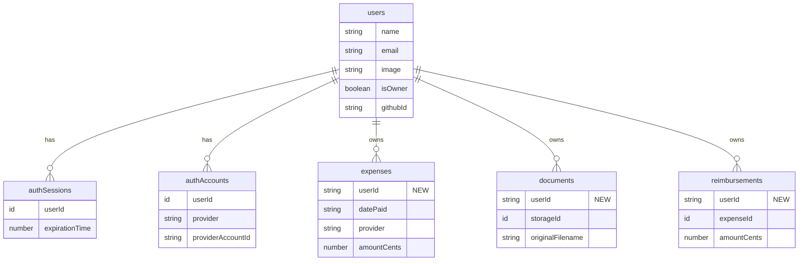

# feat: Add Convex Auth with GitHub Login

## Overview

Add authentication to the HSA Tracker using Convex Auth with GitHub social login. This restricts access to a single owner (first user to sign in) while maintaining long-term reliability by avoiding external auth service dependencies.

## Problem Statement / Motivation

The HSA Tracker is currently open to anyone who can access the URL. For public deployment, the owner needs exclusive access to their sensitive financial data. The chosen approach (Convex Auth) minimizes external dependencies for a 10-15 year data retention horizon.

## Proposed Solution

Use Convex Auth with GitHub OAuth provider:
- First user to sign in becomes the owner
- All subsequent sign-in attempts are blocked
- Existing data is migrated to the owner on first sign-in
- All queries/mutations filter by userId

## Technical Approach

### Architecture

```
┌─────────────────────────────────────────────────────────────┐
│                        Frontend                              │
├─────────────────────────────────────────────────────────────┤
│  ConvexAuthProvider                                          │
│  ├── AuthLoading → Loading spinner                           │
│  ├── Unauthenticated → SignIn component                      │
│  └── Authenticated → App (Dashboard, Expenses, Optimizer)    │
└─────────────────────────────────────────────────────────────┘
                              │
                              ▼
┌─────────────────────────────────────────────────────────────┐
│                     Convex Backend                           │
├─────────────────────────────────────────────────────────────┤
│  auth.ts          → GitHub OAuth config                      │
│  http.ts          → OAuth callback routes                    │
│  schema.ts        → authTables + userId fields               │
│  *.ts             → getAuthUserId() checks in all functions  │
└─────────────────────────────────────────────────────────────┘
                              │
                              ▼
┌─────────────────────────────────────────────────────────────┐
│                     GitHub OAuth                             │
│  (OAuth app → callback → token exchange)                     │
└─────────────────────────────────────────────────────────────┘
```

### Schema Changes



### Implementation Phases

#### Phase 1: Backend Setup

**Tasks:**
- [x] Install dependencies (`@convex-dev/auth`, `@auth/core@0.37.0`)
- [x] Generate JWT keys and configure environment variables
- [x] Create `convex/auth.config.ts` with JWT provider config
- [x] Create `convex/auth.ts` with GitHub provider and owner-only callback
- [x] Create `convex/http.ts` with auth routes
- [x] Update `convex/tsconfig.json` with moduleResolution: "Bundler" (already configured)

**Files:**
- `package.json` - add dependencies
- `convex/auth.config.ts` - new file
- `convex/auth.ts` - new file
- `convex/http.ts` - new file
- `convex/tsconfig.json` - update

#### Phase 2: Schema Migration

**Tasks:**
- [x] Add `authTables` to schema
- [x] Extend `users` table with `isOwner` and `githubId` fields
- [x] Add `userId` field to `expenses`, `documents`, `reimbursements` tables
- [x] Add `by_user` index to each table
- [x] Create data migration mutation for existing records (in auth.ts createOrUpdateUser callback)

**Files:**
- `convex/schema.ts` - update with authTables and userId fields
- `convex/migrations.ts` - new file for data migration

**Schema additions:**
```typescript
// convex/schema.ts
import { authTables } from "@convex-dev/auth/server";

export default defineSchema({
  ...authTables,

  expenses: defineTable({
    userId: v.optional(v.string()), // Optional during migration
    // ... existing fields
  })
    .index("by_user", ["userId"])
    // ... existing indexes

  documents: defineTable({
    userId: v.optional(v.string()),
    // ... existing fields
  })
    .index("by_user", ["userId"])

  reimbursements: defineTable({
    userId: v.optional(v.string()),
    // ... existing fields
  })
    .index("by_user", ["userId"])
});
```

#### Phase 3: Backend Authorization

**Tasks:**
- [x] Create auth helper module (`convex/lib/auth.ts`)
- [x] Update `convex/expenses.ts` - add auth checks to all 9 functions
- [x] Update `convex/documents.ts` - add auth checks to 7 functions
- [x] Update `convex/reimbursements.ts` - add auth checks to 4 functions
- [x] Update `convex/optimizer.ts` - add auth checks to 2 functions
- [x] Keep `convex/ocr.ts` internal mutations exempt (they run via scheduler)

**Files:**
- `convex/lib/auth.ts` - new helper module
- `convex/expenses.ts` - add auth checks
- `convex/documents.ts` - add auth checks
- `convex/reimbursements.ts` - add auth checks
- `convex/optimizer.ts` - add auth checks

**Auth helper pattern:**
```typescript
// convex/lib/auth.ts
import { getAuthUserId } from "@convex-dev/auth/server";
import { QueryCtx, MutationCtx } from "../_generated/server";

export async function requireAuth(ctx: QueryCtx | MutationCtx) {
  const userId = await getAuthUserId(ctx);
  if (!userId) {
    throw new Error("Not authenticated");
  }
  return userId;
}
```

**Usage in functions:**
```typescript
// convex/expenses.ts
import { requireAuth } from "./lib/auth";

export const list = query({
  args: { /* ... */ },
  handler: async (ctx, args) => {
    const userId = await requireAuth(ctx);

    let expenses = await ctx.db
      .query("expenses")
      .withIndex("by_user", (q) => q.eq("userId", userId))
      .order("desc")
      .collect();
    // ... rest of logic
  },
});
```

#### Phase 4: Frontend Auth UI

**Tasks:**
- [x] Update `src/main.tsx` - replace ConvexProvider with ConvexAuthProvider
- [x] Create `src/components/auth/sign-in.tsx` - GitHub sign-in button
- [x] Create `src/components/auth/auth-loading.tsx` - loading state
- [x] Update `src/App.tsx` - wrap with Authenticated/Unauthenticated
- [x] Add sign-out button to header

**Files:**
- `src/main.tsx` - update provider
- `src/components/auth/sign-in.tsx` - new file
- `src/components/auth/auth-loading.tsx` - new file
- `src/App.tsx` - add auth gates
- `src/components/layout/header.tsx` - add sign-out (if header exists, or add to App)

**Frontend structure:**
```typescript
// src/main.tsx
import { ConvexAuthProvider } from "@convex-dev/auth/react";

<ConvexAuthProvider client={convex}>
  <App />
</ConvexAuthProvider>

// src/App.tsx
import { Authenticated, Unauthenticated, AuthLoading } from "convex/react";

function App() {
  return (
    <>
      <AuthLoading>
        <AuthLoadingScreen />
      </AuthLoading>
      <Unauthenticated>
        <SignIn />
      </Unauthenticated>
      <Authenticated>
        {/* Existing app content */}
        <Header /> {/* with sign-out button */}
        <Tabs>...</Tabs>
      </Authenticated>
    </>
  );
}
```

#### Phase 5: Environment & Deployment

**Tasks:**
- [x] Create GitHub OAuth App (dev environment)
- [x] Set environment variables in Convex dashboard
- [x] Update `.env.example` with new variables
- [x] Document production OAuth app setup (in .env.example)

**Environment variables:**
```bash
# Convex dashboard (npx convex env set)
AUTH_GITHUB_ID=<github_oauth_client_id>
AUTH_GITHUB_SECRET=<github_oauth_client_secret>
SITE_URL=http://localhost:5173
JWT_PRIVATE_KEY=<generated_key>
JWKS=<generated_jwks>
```

**GitHub OAuth App settings:**
- Homepage URL: `http://localhost:5173`
- Callback URL: `https://<deployment>.convex.site/api/auth/callback/github`

## Acceptance Criteria

### Functional Requirements

- [ ] First user to sign in becomes the owner
- [ ] Owner can sign in with GitHub and access all features
- [ ] Owner can sign out
- [ ] Non-owner users see "access denied" message after GitHub OAuth
- [ ] Existing expenses, documents, and reimbursements are assigned to owner on first sign-in
- [ ] All data queries return only the owner's data
- [ ] Deep links (e.g., `?tab=expenses`) work after authentication

### Non-Functional Requirements

- [ ] Loading state shown while auth is being checked (no flash of wrong content)
- [ ] Session persists across browser sessions (localStorage tokens)
- [ ] Graceful error handling for OAuth failures
- [ ] No security vulnerabilities (all endpoints protected)

### Quality Gates

- [x] `bun run lint` passes
- [x] `bun run test` passes (update tests for auth context)
- [x] `bun run build` passes
- [ ] Manual testing of all auth flows - *after OAuth setup*

## Security Considerations

1. **Server-side enforcement**: All authorization checked via `getAuthUserId()` in backend functions
2. **Owner-only registration**: `createOrUpdateUser` callback rejects non-owners
3. **Token storage**: Refresh tokens in localStorage (standard for Convex third-party backend)
4. **XSS protection**: React prevents typical XSS; avoid `dangerouslySetInnerHTML`
5. **Internal functions exempt**: OCR processing via scheduler doesn't have user context

## Edge Cases

| Scenario | Behavior |
|----------|----------|
| GitHub OAuth denied by user | Show "Sign-in cancelled" message |
| GitHub unavailable | Show "GitHub sign-in unavailable" message |
| Session expires mid-form | Show toast "Session expired" with sign-in button |
| Multiple tabs, sign out in one | Other tabs show auth error on next action |
| Deep link while unauthenticated | Preserve URL, redirect back after sign-in |

## Dependencies

- `@convex-dev/auth` - Convex Auth library
- `@auth/core@0.37.0` - Auth.js core (pinned version for compatibility)
- GitHub OAuth App - External configuration

## Open Questions (Resolved)

| Question | Resolution |
|----------|------------|
| How is owner stored? | `isOwner: true` field on user record |
| What about existing data? | Migration mutation assigns userId to all records |
| Blocked user message? | "This HSA Tracker is private and already has an owner." |
| Internal mutations? | Exempt from auth (run via scheduler) |
| Session duration? | Convex Auth defaults (~30 days with refresh) |

## Testing Plan

1. **First-time owner flow**: Sign in with GitHub → becomes owner → sees dashboard
2. **Returning owner flow**: Sign out → sign back in → sees same data
3. **Blocked user flow**: Second GitHub account → sees access denied
4. **Data isolation**: Owner A's data not visible to hypothetical Owner B (test via direct API)
5. **Session expiration**: Manually expire token → mutation fails → re-auth works
6. **Deep linking**: Visit `?tab=expenses` while logged out → after sign-in, land on expenses

## References

### Internal References
- Brainstorm: `docs/brainstorms/2026-02-03-authentication-brainstorm.md`
- Schema: `convex/schema.ts`
- Entry point: `src/main.tsx`
- App component: `src/App.tsx`

### External References
- [Convex Auth Documentation](https://labs.convex.dev/auth)
- [Convex Auth Setup Guide](https://labs.convex.dev/auth/setup)
- [GitHub OAuth Configuration](https://labs.convex.dev/auth/config/oauth/github)
- [Authorization Best Practices](https://stack.convex.dev/authorization)

## Rollback Plan

If issues arise after deployment:
1. Revert frontend to use `ConvexProvider` instead of `ConvexAuthProvider`
2. Remove auth checks from backend functions
3. Keep schema changes (userId fields) - they're optional and don't break queries
