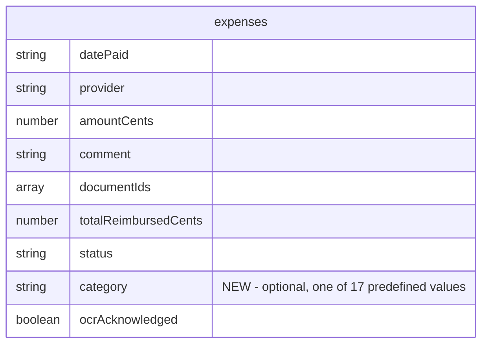

# Deployment Readiness: CI/CD, Vercel, and Expense Categories

## Overview

Make the HSA Tracker production-ready with three features:

1. **HSA Qualified Medical Expense Categories** - Add an optional category field to expenses based on IRS Publication 502, with 17 predefined categories. Users can filter to find uncategorized expenses and assign them later.

2. **GitHub Actions CI/CD** - Automated quality gates on pull requests and pushes to main: type checking, linting, unit tests, and build verification.

3. **Vercel Deployment** - Auto-deploy to production on merge to main, with preview deployments for pull requests. Frontend connects to existing Convex production backend.

## Problem Statement

The application is feature-complete for personal use but cannot be accessed outside the development environment. There's no automated quality assurance, no deployment pipeline, and expenses lack categorization for IRS compliance tracking.

**Current state:**
- No CI/CD pipeline - code quality issues can reach main branch
- No production deployment - only accessible via `localhost`
- No expense categorization - difficult to organize expenses by qualified medical expense type

**Target state:**
- Automated checks prevent broken code from merging
- Production deployment accessible via URL
- Expenses categorized by IRS-aligned types with filtering capability

## Proposed Solution

### Phase 1: GitHub Actions CI/CD
Create a single workflow that runs on PRs and pushes to main, executing type check, lint, unit tests, and build in parallel.

### Phase 2: Vercel Deployment
Configure Vercel with auto-deploy on main and preview deploys for PRs. Connect to existing Convex production backend.

### Phase 3: Expense Categories
Add optional `category` field to schema, create predefined category constants, update forms with dropdown, add table column and filter.

## Technical Approach

### Architecture

```
┌─────────────────────────────────────────────────────────────────┐
│                        GitHub Repository                        │
├─────────────────────────────────────────────────────────────────┤
│  Push/PR ──> GitHub Actions CI                                  │
│              ├── Type Check (tsc --noEmit)                      │
│              ├── Lint (eslint)                                  │
│              ├── Unit Tests (vitest)                            │
│              └── Build (vite build)                             │
│                        │                                        │
│                        ▼                                        │
│              All pass? ──> Vercel Deploy                        │
│                            │                                    │
│              ┌────────────┴────────────┐                       │
│              ▼                         ▼                        │
│     PR Branch                    Main Branch                    │
│     ┌─────────────┐              ┌─────────────┐               │
│     │ Preview URL │              │ Production  │               │
│     └──────┬──────┘              └──────┬──────┘               │
│            │                            │                       │
└────────────┼────────────────────────────┼───────────────────────┘
             │                            │
             ▼                            ▼
┌────────────────────────┐    ┌────────────────────────┐
│  Convex PREVIEW        │    │  Convex PRODUCTION     │
│  (isolated per branch) │    │  (main deployment)     │
│  - Schema changes safe │    │  - Real user data      │
│  - Auto-cleanup 5 days │    │  - Permanent           │
└────────────────────────┘    └────────────────────────┘
```

**Key Safety Guarantee:** PR branches deploy schema changes to isolated Convex preview deployments only. Production Convex is updated only when code is merged to main.

### Data Model Changes



**Category Field Design:**
- Type: `v.optional(v.string())` - nullable string
- Values: One of 17 predefined category slugs (e.g., `"medical-services"`, `"dental-care"`)
- Index: `by_category` for efficient filtering
- Compound index: `by_category_and_date` for filtered + sorted queries

### Implementation Phases

#### Phase 1: GitHub Actions CI/CD

**Tasks and deliverables:**
- [x] Create `.github/workflows/ci.yml` workflow file
- [x] Configure Bun setup with caching
- [x] Run type check, lint, tests, build in parallel jobs
- [ ] Test workflow with a test PR

**Success criteria:**
- PRs show CI status checks
- Failed checks block merge (via branch protection)
- CI completes in under 3 minutes

**Files to create/modify:**
| File | Action |
|------|--------|
| `.github/workflows/ci.yml` | Create |

**Implementation:**

```yaml
# .github/workflows/ci.yml
name: CI

on:
  push:
    branches: [main]
  pull_request:
    branches: [main]

concurrency:
  group: ${{ github.workflow }}-${{ github.ref }}
  cancel-in-progress: true

jobs:
  typecheck:
    runs-on: ubuntu-latest
    steps:
      - uses: actions/checkout@v4
      - uses: oven-sh/setup-bun@v2
      - uses: actions/cache@v4
        with:
          path: ~/.bun/install/cache
          key: ${{ runner.os }}-bun-${{ hashFiles('**/bun.lockb') }}
          restore-keys: ${{ runner.os }}-bun-
      - run: bun install --frozen-lockfile
      - run: bunx tsc --noEmit

  lint:
    runs-on: ubuntu-latest
    steps:
      - uses: actions/checkout@v4
      - uses: oven-sh/setup-bun@v2
      - uses: actions/cache@v4
        with:
          path: ~/.bun/install/cache
          key: ${{ runner.os }}-bun-${{ hashFiles('**/bun.lockb') }}
          restore-keys: ${{ runner.os }}-bun-
      - run: bun install --frozen-lockfile
      - run: bun run lint

  test:
    runs-on: ubuntu-latest
    steps:
      - uses: actions/checkout@v4
      - uses: oven-sh/setup-bun@v2
      - uses: actions/cache@v4
        with:
          path: ~/.bun/install/cache
          key: ${{ runner.os }}-bun-${{ hashFiles('**/bun.lockb') }}
          restore-keys: ${{ runner.os }}-bun-
      - run: bun install --frozen-lockfile
      - run: bun run test:run

  build:
    runs-on: ubuntu-latest
    steps:
      - uses: actions/checkout@v4
      - uses: oven-sh/setup-bun@v2
      - uses: actions/cache@v4
        with:
          path: ~/.bun/install/cache
          key: ${{ runner.os }}-bun-${{ hashFiles('**/bun.lockb') }}
          restore-keys: ${{ runner.os }}-bun-
      - run: bun install --frozen-lockfile
      - run: bun run build
```

---

#### Phase 2: Vercel Deployment + Convex Integration

**Tasks and deliverables:**
- [ ] Create Vercel account (if needed)
- [ ] Create Vercel project linked to GitHub repo
- [ ] Configure build settings (Vite, Bun)
- [ ] Get `CONVEX_DEPLOY_KEY` from Convex dashboard
- [ ] Add environment variables to Vercel
- [x] Create `vercel.json` for configuration
- [ ] Verify preview deploy on test PR (uses Convex preview)
- [ ] Verify production deploy on merge to main (uses Convex production)
- [ ] Enable branch protection requiring CI to pass

**Success criteria:**
- PRs generate preview URLs with isolated Convex backend
- PR schema changes do NOT affect production Convex
- Merges to main deploy to both Vercel production AND Convex production
- App fully functional in both preview and production

**Files to create/modify:**
| File | Action |
|------|--------|
| `vercel.json` | Create |
| `docs/DEPLOYMENT.md` | Create (setup guide) |

**Implementation:**

```json
// vercel.json
{
  "installCommand": "bun install",
  "framework": "vite",
  "outputDirectory": "dist",
  "build": {
    "env": {
      "CONVEX_DEPLOY_KEY": "@convex_deploy_key"
    }
  }
}
```

```bash
# package.json - add deploy scripts
"scripts": {
  "deploy:preview": "bunx convex deploy --preview \"$VERCEL_GIT_COMMIT_REF\" && bun run build",
  "deploy:production": "bunx convex deploy && bun run build"
}
```

**Vercel Build Command Configuration:**
- **Production (main branch):** `bun run deploy:production`
- **Preview (other branches):** `bun run deploy:preview`

This is configured in Vercel Project Settings → General → Build & Development Settings, using the "Override" option for build command with environment-based logic, OR by using `vercel.json` with git branch detection.

**Alternative: Single smart build command**
```bash
# In vercel.json buildCommand:
if [ "$VERCEL_GIT_COMMIT_REF" = "main" ]; then bunx convex deploy && bun run build; else bunx convex deploy --preview "$VERCEL_GIT_COMMIT_REF" && bun run build; fi
```

**Environment Variables (Vercel Dashboard):**
| Variable | Value | Scope |
|----------|-------|-------|
| `CONVEX_DEPLOY_KEY` | From Convex Dashboard → Settings → Deploy Key | Production & Preview |
| `VITE_CONVEX_URL` | `https://your-deployment.convex.cloud` | Production only |

Note: For preview deployments, `VITE_CONVEX_URL` is automatically set by `convex deploy --preview` which outputs the preview URL.

**Getting CONVEX_DEPLOY_KEY:**
1. Go to Convex Dashboard (https://dashboard.convex.dev)
2. Select your project
3. Go to Settings → Deploy Key
4. Copy the key
5. Add to Vercel as environment variable (mark as "Sensitive")

**Setup Guide (docs/DEPLOYMENT.md):**
1. Create Vercel account at vercel.com
2. Import GitHub repository
3. Framework: Vite (auto-detected)
4. Add environment variables:
   - `CONVEX_DEPLOY_KEY` (from Convex dashboard, mark sensitive)
   - `VITE_CONVEX_URL` (your production Convex URL)
5. Set build command to the smart command above
6. Deploy
7. Enable GitHub branch protection rules requiring CI to pass

---

#### Phase 3: Expense Categories

**Tasks and deliverables:**

**3a. Backend (Convex)**
- [x] Add `category` field to expenses schema
- [x] Add `by_category` and `by_category_and_date` indexes
- [x] Update `create` mutation to accept category
- [x] Update `update` mutation to accept category
- [x] Update `list` query to filter by category
- [ ] Push schema changes

**3b. Constants & Validation**
- [x] Create `src/lib/constants/expense-categories.ts` with 17 categories
- [x] Update `src/lib/validations/expense.ts` to include category

**3c. Form UI**
- [x] Add category Select dropdown to `expense-form.tsx`
- [x] Include "No Category" option for clearing

**3d. Table UI**
- [x] Add category column to `expense-columns.tsx`
- [x] Add category filter dropdown to `expense-table.tsx`
- [x] Include "Uncategorized" filter option

**3e. Import/Export**
- [x] Add `category` field to `ParsedRow` interface in `import-utils.ts`
- [x] Add `category` to `COLUMN_MAPPINGS` with aliases: `["category", "type", "expense type"]`
- [x] Update `parseRow()` to extract and validate category using `isValidCategory()`
- [x] Update import wizard UI to show category column in preview table
- [x] Handle invalid category values gracefully (show warning, import as uncategorized)
- [x] Add category to CSV export in `export.ts`

**Success criteria:**
- Users can assign category when creating/editing expenses
- Users can clear a category (set back to uncategorized)
- Users can filter expense table by category
- "Uncategorized" filter shows expenses without category
- CSV import can map category column
- CSV export includes category column

**Files to create/modify:**
| File | Action |
|------|--------|
| `convex/schema.ts` | Modify - add category field and indexes |
| `convex/expenses.ts` | Modify - add category to mutations/queries |
| `src/lib/constants/expense-categories.ts` | Create |
| `src/lib/validations/expense.ts` | Modify - add category |
| `src/components/expenses/expense-form.tsx` | Modify - add dropdown |
| `src/components/expenses/expense-columns.tsx` | Modify - add column |
| `src/components/expenses/expense-table.tsx` | Modify - add filter |
| `src/lib/export.ts` | Modify - add category |
| `src/lib/import-utils.ts` | Modify - add category parsing |
| `src/components/import/import-wizard.tsx` | Modify - add category column display |

**Implementation:**

```typescript
// src/lib/constants/expense-categories.ts

/**
 * IRS-aligned HSA qualified medical expense categories.
 * Based on IRS Publication 502.
 * @see https://www.irs.gov/publications/p502
 */

// Define values as const tuple for proper type inference with z.enum()
export const EXPENSE_CATEGORY_VALUES = [
  "medical-services",
  "dental-care",
  "vision-care",
  "prescriptions",
  "mental-health",
  "hospital-facility",
  "lab-diagnostic",
  "physical-therapy",
  "chiropractic",
  "medical-equipment",
  "medical-supplies",
  "hearing",
  "nursing-home-care",
  "transportation",
  "long-term-care",
  "preventive-care",
  "other-qualified",
] as const

// Derive union type from const tuple
export type ExpenseCategory = typeof EXPENSE_CATEGORY_VALUES[number]

// Full category metadata with type-safe values
export const EXPENSE_CATEGORIES = [
  { value: "medical-services", label: "Medical Services", description: "Doctor visits, specialists, exams" },
  { value: "dental-care", label: "Dental Care", description: "Fillings, extractions, dentures, braces" },
  { value: "vision-care", label: "Vision Care", description: "Exams, glasses, contacts, surgery" },
  { value: "prescriptions", label: "Prescriptions", description: "Rx drugs, insulin" },
  { value: "mental-health", label: "Mental Health", description: "Therapy, psychiatry, counseling" },
  { value: "hospital-facility", label: "Hospital/Facility", description: "Inpatient, outpatient, ER" },
  { value: "lab-diagnostic", label: "Lab & Diagnostic", description: "Blood work, imaging, tests" },
  { value: "physical-therapy", label: "Physical Therapy", description: "PT sessions, rehabilitation" },
  { value: "chiropractic", label: "Chiropractic", description: "Chiropractic adjustments, care" },
  { value: "medical-equipment", label: "Medical Equipment", description: "Monitors, CPAP, mobility aids" },
  { value: "medical-supplies", label: "Medical Supplies", description: "Bandages, first aid, OTC eligible" },
  { value: "hearing", label: "Hearing", description: "Exams, hearing aids, batteries" },
  { value: "nursing-home-care", label: "Nursing/Home Care", description: "Nursing services, home health" },
  { value: "transportation", label: "Transportation", description: "Medical travel, mileage, parking" },
  { value: "long-term-care", label: "Long-Term Care", description: "Long-term care services" },
  { value: "preventive-care", label: "Preventive Care", description: "Vaccines, screenings" },
  { value: "other-qualified", label: "Other Qualified Expense", description: "Other IRS-qualified expenses" },
] as const satisfies readonly { value: ExpenseCategory; label: string; description: string }[]

// Type-safe label lookup
export function getCategoryLabel(value: ExpenseCategory | undefined | null): string {
  if (!value) return "Uncategorized"
  return EXPENSE_CATEGORIES.find(c => c.value === value)?.label ?? value
}

// Type guard for validating unknown strings (useful for CSV import)
export function isValidCategory(value: unknown): value is ExpenseCategory {
  return typeof value === "string" &&
    (EXPENSE_CATEGORY_VALUES as readonly string[]).includes(value)
}
```

```typescript
// convex/schema.ts (additions)
expenses: defineTable({
  // ... existing fields
  category: v.optional(v.string()),
})
  // ... existing indexes
  .index("by_category", ["category"])
  .index("by_category_and_date", ["category", "datePaid"])
```

```typescript
// src/lib/validations/expense.ts (updated)
import { z } from "zod"
import { EXPENSE_CATEGORY_VALUES } from "@/lib/constants/expense-categories"

export const expenseSchema = z.object({
  datePaid: z.date({ required_error: "Date is required" }),
  provider: z.string().min(1, "Provider is required").max(200),
  amount: z.coerce.number().positive("Amount must be positive"),
  comment: z.string().max(1000).optional(),
  // Use const tuple directly with z.enum() for type safety
  // .nullish() = optional | null (cleaner than .optional().nullable())
  category: z.enum(EXPENSE_CATEGORY_VALUES).nullish(),
})

export type ExpenseFormData = z.infer<typeof expenseSchema>
```

```typescript
// src/lib/import-utils.ts (additions)
import { isValidCategory, type ExpenseCategory } from "@/lib/constants/expense-categories"

// Update ParsedRow interface
export interface ParsedRow {
  date: string | null
  provider: string | null
  amountCents: number | null
  comment: string | null
  category: ExpenseCategory | null  // NEW
  categoryWarning?: string          // NEW - for invalid category values
  rowIndex: number
  errors: string[]
}

// Add category to COLUMN_MAPPINGS
const COLUMN_MAPPINGS: Record<string, string[]> = {
  date: ["date", "date paid", "datepaid"],
  provider: ["paid to", "paidto", "provider", "vendor"],
  amount: ["amount", "cost", "price"],
  comment: ["comment", "comments", "notes", "note"],
  category: ["category", "type", "expense type", "expensetype"],  // NEW
}

// In parseRow(), add category handling:
// Category (OPTIONAL column - CSV files without a category column import normally)
// If column exists but value is empty/invalid, import as uncategorized with optional warning
let category: ExpenseCategory | null = null
let categoryWarning: string | undefined = undefined
if (indexes.category !== undefined) {  // Column exists in CSV
  const rawCategory = cells[indexes.category]?.trim().toLowerCase()
  if (rawCategory) {
    // Try exact match first
    if (isValidCategory(rawCategory)) {
      category = rawCategory
    } else {
      // Try to match by label (e.g., "Medical Services" -> "medical-services")
      const normalized = rawCategory.replace(/\s+/g, "-")
      if (isValidCategory(normalized)) {
        category = normalized
      } else {
        // Invalid category - import as uncategorized with warning
        categoryWarning = `Unknown category "${rawCategory}" - imported as uncategorized`
      }
    }
  }
}
// Return includes: category, categoryWarning
```

## Alternative Approaches Considered

### CI/CD Alternatives

| Approach | Pros | Cons | Rejected Because |
|----------|------|------|------------------|
| **GitHub Actions (chosen)** | Native integration, free for public repos, familiar | None significant | - |
| GitLab CI | Powerful, good caching | Requires GitLab migration | Not worth migration overhead |
| CircleCI | Fast, good parallelism | Extra integration, cost | Unnecessary complexity |
| No CI | Simplest | No quality gates | Defeats purpose of deployment readiness |

### Deployment Alternatives

| Approach | Pros | Cons | Rejected Because |
|----------|------|------|------------------|
| **Vercel (chosen)** | Vite-optimized, free tier, preview deploys | Vendor lock-in | Best DX for Vite apps |
| Netlify | Similar features | Slightly less Vite-optimized | Vercel has better Vite support |
| Cloudflare Pages | Fast, good free tier | Less integrated with GitHub | Preview deploy UX not as polished |
| Self-hosted | Full control | Complexity, maintenance | Overkill for personal project |

### Category Storage Alternatives

| Approach | Pros | Cons | Rejected Because |
|----------|------|------|------------------|
| **String field (chosen)** | Simple, no joins, easy filtering | No referential integrity | Simplicity wins for fixed list |
| Separate categories table | Referential integrity, extensible | Joins, complexity | YAGNI - fixed list doesn't need this |
| Enum type | Type safety in DB | Convex doesn't have native enums | Not supported |
| Integer codes | Compact storage | Requires lookup, less readable | Strings are clearer |

## Acceptance Criteria

### Functional Requirements

- [ ] **CI-1**: GitHub Actions workflow runs on all PRs to main
- [ ] **CI-2**: GitHub Actions workflow runs on all pushes to main
- [ ] **CI-3**: Type check job fails if TypeScript errors exist
- [ ] **CI-4**: Lint job fails if ESLint errors exist
- [ ] **CI-5**: Test job fails if any Vitest tests fail
- [ ] **CI-6**: Build job fails if Vite build fails

- [ ] **DEPLOY-1**: Merging to main triggers production deployment (Vercel + Convex)
- [ ] **DEPLOY-2**: Opening a PR triggers preview deployment (Vercel + Convex preview)
- [ ] **DEPLOY-3**: Preview URL is accessible and functional
- [ ] **DEPLOY-4**: Production deployment connects to Convex production backend
- [ ] **DEPLOY-5**: Preview deployments connect to isolated Convex preview (NOT production)
- [ ] **DEPLOY-6**: PR schema changes do not affect production Convex data
- [ ] **DEPLOY-7**: Branch protection requires CI to pass before merge

- [ ] **CAT-1**: Users can select a category when creating an expense
- [ ] **CAT-2**: Users can select a category when editing an expense
- [ ] **CAT-3**: Users can clear/remove a category from an expense
- [ ] **CAT-4**: Expense table displays category column
- [ ] **CAT-5**: Users can filter expenses by specific category
- [ ] **CAT-6**: Users can filter to show only uncategorized expenses
- [ ] **CAT-7**: CSV export includes category column
- [ ] **CAT-8**: CSV import detects category column if present (optional - CSV without category column imports normally)
- [ ] **CAT-9**: CSV import validates category values against predefined list
- [ ] **CAT-10**: Invalid/missing category values in CSV import as uncategorized (non-blocking, shows warning for invalid)

### Non-Functional Requirements

- [ ] **PERF-1**: CI pipeline completes in under 5 minutes
- [ ] **PERF-2**: Category filter queries use index (no full table scan)
- [ ] **PERF-3**: Category dropdown renders without lag (~17 items)

### Quality Gates

- [x] All existing tests pass (67 tests)
- [x] No new TypeScript errors
- [x] No new ESLint errors (warnings fixed)
- [ ] Manual testing of category CRUD flow
- [ ] Manual testing of category filtering
- [ ] Verify preview and production deployments work

## Success Metrics

| Metric | Target | Measurement |
|--------|--------|-------------|
| CI run time | < 5 min | GitHub Actions timing |
| Deploy time | < 2 min | Vercel dashboard |
| Category assignment rate | > 50% of new expenses | Query uncategorized count over time |
| Zero deployment failures | 100% success | Vercel deployment history |

## Dependencies & Prerequisites

### External Dependencies
- GitHub account with repo access
- Vercel account (to be created)
- Existing Convex production deployment

### Internal Dependencies
| Dependency | Required For | Status |
|------------|--------------|--------|
| Existing tests passing | CI to succeed | Verify |
| ESLint config | Lint job | Exists |
| Vite build working | Build job, Vercel | Exists |
| Convex production URL | Vercel env var | Exists |

### Secrets Required
| Secret | Where | Purpose |
|--------|-------|---------|
| `CONVEX_DEPLOY_KEY` | Vercel env vars (sensitive) | Deploy Convex schema/functions |
| `VITE_CONVEX_URL` | Vercel env vars (production only) | Connect frontend to Convex production |

## Risk Analysis & Mitigation

| Risk | Likelihood | Impact | Mitigation |
|------|------------|--------|------------|
| Existing lint/type errors | Medium | Blocks CI | Run locally first, fix before enabling CI |
| Vercel build fails | Low | Blocks deploy | Test `bun run build` locally |
| Convex schema migration issues | Low | Data issues | Schema is additive (optional field), low risk |
| Category filter performance | Low | Slow queries | Add index from start |
| Convex preview cleanup (5 days) | Low | Stale previews | Convex auto-cleans; acceptable for free tier |
| CONVEX_DEPLOY_KEY exposure | Low | Security | Mark as sensitive in Vercel; never commit |

## Resource Requirements

- **Time**: Implementation can be done incrementally
- **Cost**: Free tier sufficient (GitHub Actions, Vercel, Convex)
- **Infrastructure**: No additional infrastructure needed

## Future Considerations

### Potential Enhancements (Not in Scope)
- Dashboard summary by category (spending breakdown)
- Category auto-suggestion based on provider name
- OCR extraction of category from receipt text
- Custom categories (user-defined)
- E2E tests in CI pipeline (Playwright)

### Extensibility Points
- Category constants file is easy to extend with new categories
- Index structure supports future category-based reports
- Filter UI pattern can be reused for other fields

## Documentation Plan

| Document | Purpose | Status |
|----------|---------|--------|
| `docs/DEPLOYMENT.md` | Vercel setup instructions | ✅ Created |
| Code comments in `expense-categories.ts` | IRS reference | ✅ Created |
| README update | Add deployment badges, features | ✅ Updated |

## Implementation Notes

_Added during implementation phase._

### Build Configuration Learnings

1. **Build command**: Changed from `tsc -b && vite build` to `tsc --noEmit && vite build`. The `tsc -b` (build mode) was following imports from src files into convex files and checking them with the wrong tsconfig.

2. **Convex types**: Added `"types": ["node"]` to `convex/tsconfig.json` because `convex/ocr.ts` uses `process.env` which requires Node.js types.

3. **CI branch name**: The project uses `master` as the default branch, not `main`. Updated CI workflow accordingly.

### ESLint Configuration Fixes

Added ignores to `eslint.config.js` for files that should not be linted:
- `src/components/ui/*` - shadcn/ui generated components (have intentional patterns that trigger warnings)
- `convex/_generated/*` - Convex generated files

### Code Quality Fixes Made

1. **React hooks exhaustive deps**: Wrapped `uploadFile` functions in `useCallback` in both `file-uploader.tsx` and `expense-dialog.tsx` to fix missing dependency warnings.

2. **TanStack Table warning**: Added eslint-disable comment for `react-hooks/incompatible-library` - this is a known library limitation that works correctly at runtime.

3. **Test file types**: Changed `as any` to `as Id<"expenses">` in `import-utils.test.ts` for proper type safety.

4. **Unused import**: Removed unused `formatFileSize` import from `expense-dialog.tsx`.

### Files Created/Modified

| File | Status | Notes |
|------|--------|-------|
| `.github/workflows/ci.yml` | ✅ Created | Uses `master` branch |
| `vercel.json` | ✅ Created | Smart build command for Convex preview vs production |
| `docs/DEPLOYMENT.md` | ✅ Created | Setup guide |
| `src/lib/constants/expense-categories.ts` | ✅ Created | 17 IRS-aligned categories |
| `convex/schema.ts` | ✅ Modified | Added category field and indexes |
| `convex/expenses.ts` | ✅ Modified | Added category to mutations/queries |
| `convex/tsconfig.json` | ✅ Modified | Added `"types": ["node"]` |
| `src/lib/validations/expense.ts` | ✅ Modified | Added category with z.enum() |
| `src/components/expenses/expense-form.tsx` | ✅ Modified | Added category dropdown |
| `src/components/expenses/expense-columns.tsx` | ✅ Modified | Added category column |
| `src/components/expenses/expense-table.tsx` | ✅ Modified | Added category filter, fixed TanStack warning |
| `src/lib/import-utils.ts` | ✅ Modified | Added category parsing with validation |
| `src/components/import/import-wizard.tsx` | ✅ Modified | Added category to preview and batch import |
| `src/lib/export.ts` | ✅ Modified | Added category to CSV export |
| `src/components/documents/file-uploader.tsx` | ✅ Modified | Fixed useCallback dependencies |
| `src/components/expenses/expense-dialog.tsx` | ✅ Modified | Fixed useCallback, removed unused import |
| `src/lib/import-utils.test.ts` | ✅ Modified | Fixed type assertions |
| `eslint.config.js` | ✅ Modified | Added ignores for generated files |
| `package.json` | ✅ Modified | Updated build command |
| `README.md` | ✅ Modified | Added CI/CD badges, expense categories feature |
| `CLAUDE.md` | ✅ Modified | Added user preferences section |

## References & Research

### Internal References
- Schema patterns: `convex/schema.ts`
- Mutation patterns: `convex/expenses.ts`
- Form patterns: `src/components/expenses/expense-form.tsx`
- Table filtering: `src/components/expenses/expense-table.tsx`
- Brainstorm: `docs/brainstorms/2026-02-03-deployment-readiness-brainstorm.md`

### External References
- IRS Publication 502: https://www.irs.gov/publications/p502
- IRS Publication 969 (HSA): https://www.irs.gov/publications/p969
- Vercel Vite guide: https://vercel.com/docs/frameworks/vite
- GitHub Actions Bun: https://github.com/oven-sh/setup-bun
- Convex Preview Deployments: https://docs.convex.dev/production/hosting/preview-deployments
- Convex Deploy Keys: https://docs.convex.dev/production/hosting/deploy-keys

### Related Work
- Expense sorting/filtering brainstorm: `docs/brainstorms/2026-02-03-expense-sorting-filtering-brainstorm.md`
- Import wizard plan: `docs/plans/2026-02-02-feat-expense-import-wizard-plan.md`
